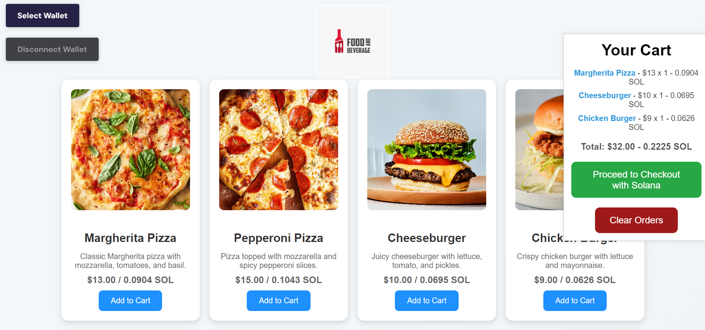
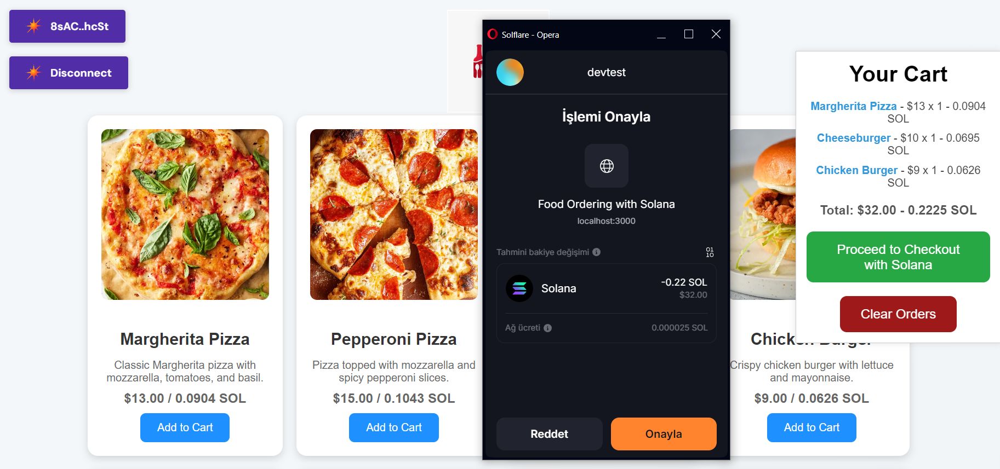

# Solana Restaurant Menu Payment App

This is made for Restaurants aiming to provide lightweight menu webpages for physical customers who usually access this site through QR codes on tables. It aims to provide a method for customers that want to use Solana tokens instead of debit cards or cash.

Run following commands respectively:

`npm install`
`npm start` 

# Screenshots

